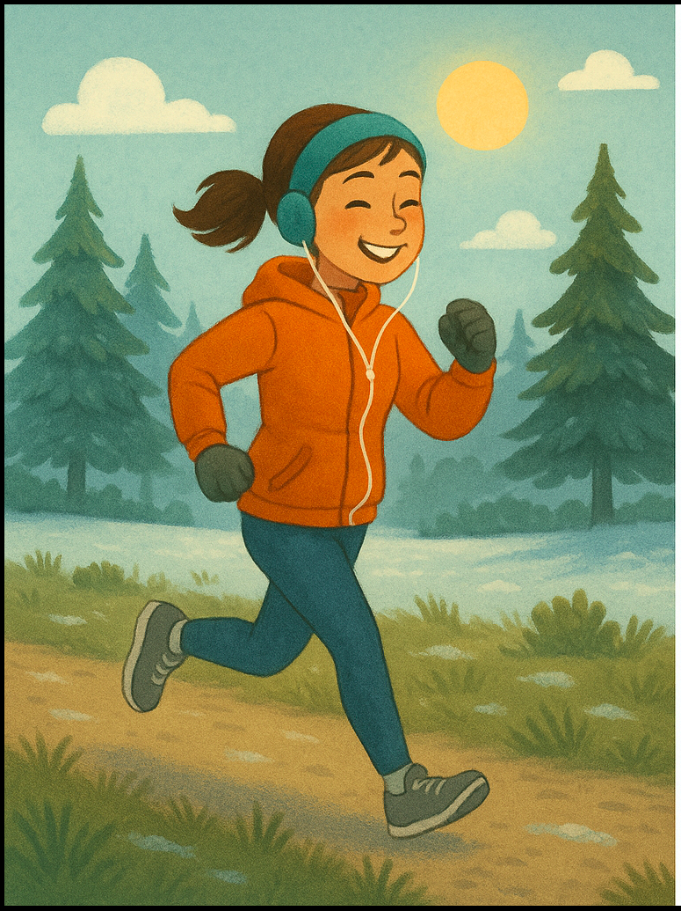
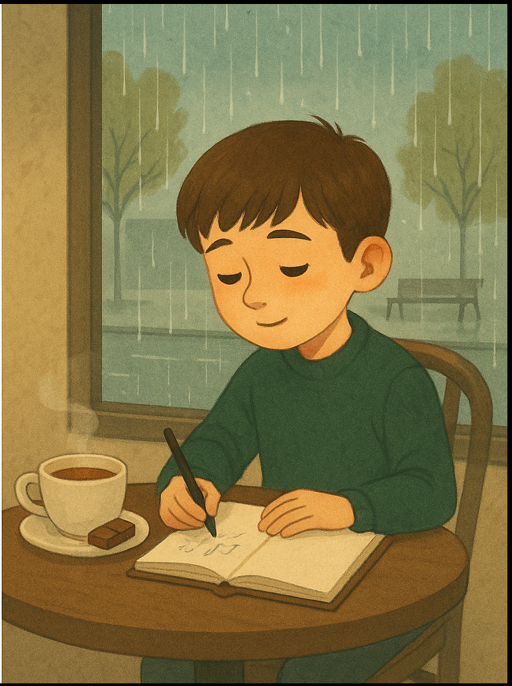
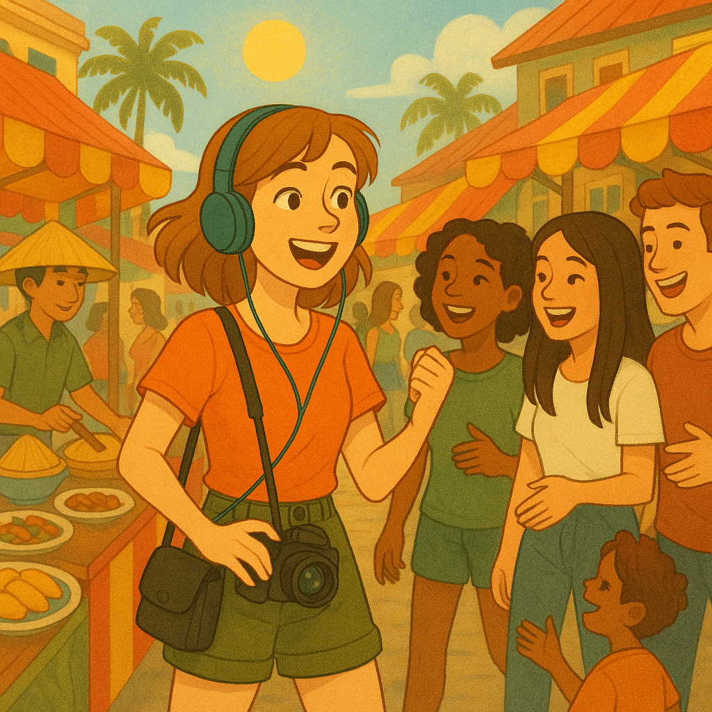

# Lesson: "Menga yoqadi, menga yoqmaydi" (I Like, I Dislike)

Welcome to your Uzbek lesson! All the information you need for this lesson is in this file. We will not use a whiteboard—please refer to this file during our online lesson.

## Lesson Objectives:
- You will learn how to say what you like and what you don't like in Uzbek.
- You will practice using new words for foods, activities, and more.
- You will ask and answer questions about your preferences.
- You will learn how to say what you like doing (using verbs).

## Key Phrases:
- `Menga ___ yoqadi.` (I like ___)
- `Menga ___ yoqmaydi.` (I don't like ___)
- `Men ___ ni yaxshi ko'raman.` (I like ___ / I love ___)
- `Men ___ ni yoqtiraman.` (I like ___)
- `Men ___ ni yoqtirmayman.` (I don't like ___)
- `Senga-chi?` (And you?)
- `Menga ___ qilish yoqadi.` (I like doing ___)
- `Menga ___ qilish yoqmaydi.` (I don't like doing ___)
- `Men ___ qilishni yaxshi ko'raman.` (I like doing ___ / I love doing ___)

## Examples:
- `Menga olma yoqadi.` (I like apples.)
- `Men olmani yaxshi ko'raman.` (I like/love apples.)
- `Men olmani yoqtiraman.` (I like apples.)
- `Menga futbol yoqmaydi.` (I don't like football.)
- `Men futbolni yoqtirmayman.` (I don't like football.)
- `Menga musiqa yoqadi.` (I like music.)
- `Men musiqani yaxshi ko'raman.` (I like/love music.)

### With verbs (I like doing):
- `Menga o'qish yoqadi.` (I like reading.)
- `Men o'qishni yaxshi ko'raman.` (I like/love reading.)
- `Menga raqsga tushish yoqmaydi.` (I don't like dancing.)
- `Men raqsga tushishni yoqtirmayman.` (I don't like dancing.)

---

## Vocabulary to Know (Bilish kerak bo'lgan so'zlar):

### Essential Verbs:
- **yaxshi ko'rmoq** — to like, to love
- **yoqtirmoq** — to like
- **uyg'onmoq** — to wake up
- **eshitmoq** — to listen, to hear
- **ichmoq** — to drink
- **yemoq** — to eat
- **uchrashmoq** — to meet

### Activities & Actions:
- **chang'i uchmoq** — to ski
- **suzmoq** — to swim
- **raqsga tushmoq** — to dance
- **yozmoq** — to write
- **rasm chizmoq** — to draw
- **suratga olmoq** — to take a photo
- **qo'shiq aytmoq** — to sing
- **sayohat qilmoq** — to travel
- **sport bilan shug'ullanmoq** — to do sports
- **velosiped haydamoq** — to ride a bike
- **galereyaga bormoq** — to go to galleries
- **film ko'rmoq** — to watch movies
- **televizor ko'rmoq** — to watch TV

### Describing People & Things:
- **quvnoq** — cheerful, happy
- **kuchli** — strong
- **tinch** — calm, peaceful
- **sokin** — quiet
- **qiziqarli** — interesting
- **faol** — active
- **juda** — very, really
- **har doim** — always
- **ko'pincha** — often
- **erta** — early

### Places & Things:
- **tashqarida** — outside
- **kafeda** — in a cafe
- **galereya** — gallery
- **do'st** — friend
- **havo** — weather
- **mamlakat** — country
- **kun** — day
- **joy** — place
- **choy** — tea
- **shokolad** — chocolate
- **musiqa** — music
- **futbol** — football
- **taom** — food

### Descriptive Words:
- **bir xil** — the same
- **yangi** — new
- **issiq** — hot
- **sovuq** — cold
- **yomg'irli** — rainy
- **ko'plab** — many, a lot of
- **tinch** — quiet, peaceful

### Useful Phrases:
- **tatib ko'rmoq** — to try (taste)
- **do'stlar bilan uchrashmoq** — to meet with friends
- **uyda o'tirmoq** — to sit at home
- **harakatda bo'lmoq** — to be active
- **har kuni** — every day

---

## Personality Activity: Guess Their Likes and Dislikes!

Read about each person. The text is in Uzbek (with English translation). Use the vocabulary list if you see a new word. After reading, look at the list and make sentences in Uzbek about what they might like or not like.

---

### 1. Maryam

**Uzbek:**
> Maryam har doim quvnoq va kuchli. U erta uyg'onishni yaxshi ko'radi. U tashqarida bo'lishni juda yoqtiradi. Maryam sovuq havoni yaxshi ko'radi. U sportni juda yoqtiradi va ko'pincha sport bilan shug'ullanadi. U televizor ko'rishni yoqtirmaydi. U musiqa eshitishni yaxshi ko'radi va ko'pincha harakatda bo'ladi.

**English:**
> Maryam is always cheerful and strong. She likes waking up early. She really likes to be outside. Maryam likes cold weather. She really likes sports and often does sports. She doesn't like watching TV. She likes listening to music and is often active.

**Things to use (Foydalanish uchun):**
- chang'i uchish (skiing)
- suzish (swimming)
- film ko'rish (watching movies)
- musiqa (music)
- futbol (football)
- issiq mamlakatlar (hot countries)
- sovuq mamlakatlar (cold countries)
- raqsga tushish (dancing)
- uyda o'tirish (sitting at home)

---

### 2. Timur

**Uzbek:**
> Timur tinch va sokin bola. U kafeda o'tirishni yaxshi ko'radi. U yozishni va rasm chizishni juda yoqtiradi. Timur choy ichishni va shokolad yeyishni yaxshi ko'radi. U sportni yoqtirmaydi. U ko'plab odamlar bo'lgan joylarni yoqtirmaydi. U yomg'irli kunlarni yaxshi ko'radi va tinch joylarni yoqtiradi.

**English:**
> Timur is a calm and quiet boy. He likes sitting in a cafe. He really likes writing and drawing. Timur likes drinking tea and eating chocolate. He does not like sports. He does not like places with many people. He likes rainy days and likes quiet places.

**Things to use (Foydalanish uchun):**
- yozish (writing)
- rasm chizish (drawing)
- choy (tea)
- shokolad (chocolate)
- velosiped haydash (cycling)
- sport bilan shug'ullanish (doing sports)
- ko'plab odamlar bilan joylar (crowded places)
- yomg'irli kunlar (rainy days)
- galereyaga borish (going to galleries)

---

### 3. Anna

**Uzbek:**
> Anna qiziqarli va faol qiz. U yangi taomlarni tatib ko'rishni juda yaxshi ko'radi. U sayohat qilishni va suratga olishni yoqtiradi. Anna musiqa eshitishni yaxshi ko'radi va do'stlari bilan uchrashishni yoqtiradi. U choy ichishni yoqtirmaydi va televizor ko'rishni yoqtirmaydi. U har kuni bir xil ishlarni qilishni yoqtirmaydi.

**English:**
> Anna is an interesting and active girl. She really likes trying new foods. She likes traveling and taking photos. Anna likes listening to music and likes meeting with friends. She does not like drinking tea and does not like watching TV. She does not like doing the same things every day.

**Things to use (Foydalanish uchun):**
- yangi taomlar tatib ko'rish (trying new foods)
- sayohat qilish (traveling)
- qo'shiq aytish (singing)
- musiqa (music)
- choy (tea)
- televizor ko'rish (watching TV)
- do'stlar bilan uchrashish (meeting friends)
- bir xil ishlarni qilish (doing the same things)
- suratga olish (taking photos)

---

## Exercise Instructions (Mashq):

For each person, make sentences in Uzbek about what they might like and don't like using the list above. You can use different phrases:

- `"Menga ___ yoqadi"` (I like ___)
- `"Men ___ ni yaxshi ko'raman"` (I like/love ___)
- `"Men ___ ni yoqtiraman"` (I like ___)
- `"Menga ___ yoqmaydi"` (I don't like ___)
- `"Men ___ ni yoqtirmayman"` (I don't like ___)

### Examples:
- **Maryam:** `Menga chang'i uchish yoqadi.` (I like skiing.)
- **Maryam:** `Men chang'i uchishni yaxshi ko'raman.` (I like/love skiing.)
- **Timur:** `Menga ko'plab odamlar bilan joylar yoqmaydi.` (I don't like crowded places.)
- **Timur:** `Men ko'plab odamlar bilan joylarni yoqtirmayman.` (I don't like crowded places.)
- **Anna:** `Men yangi taomlar tatib ko'rishni yaxshi ko'raman.` (I like/love trying new foods.)

**Write at least 7 sentences for each person using different phrases!**

---

## Homework (Uyga vazifa):

Write 5 sentences in Uzbek about what you like and don't like. Try to use different phrases (yoqadi, yaxshi ko'raman, yoqtiraman, etc.). For example:

- `Menga olma yoqadi.` (I like apples.)
- `Men futbolni yoqtirmayman.` (I don't like football.)
- `Men suzishni yaxshi ko'raman.` (I like/love swimming.)
- `Menga raqsga tushish yoqmaydi.` (I don't like dancing.)

**Please keep this file open during our lesson. See you soon!** 